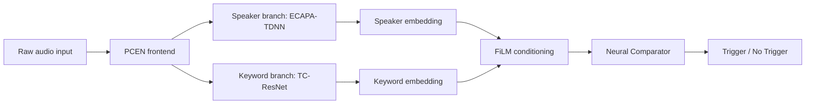
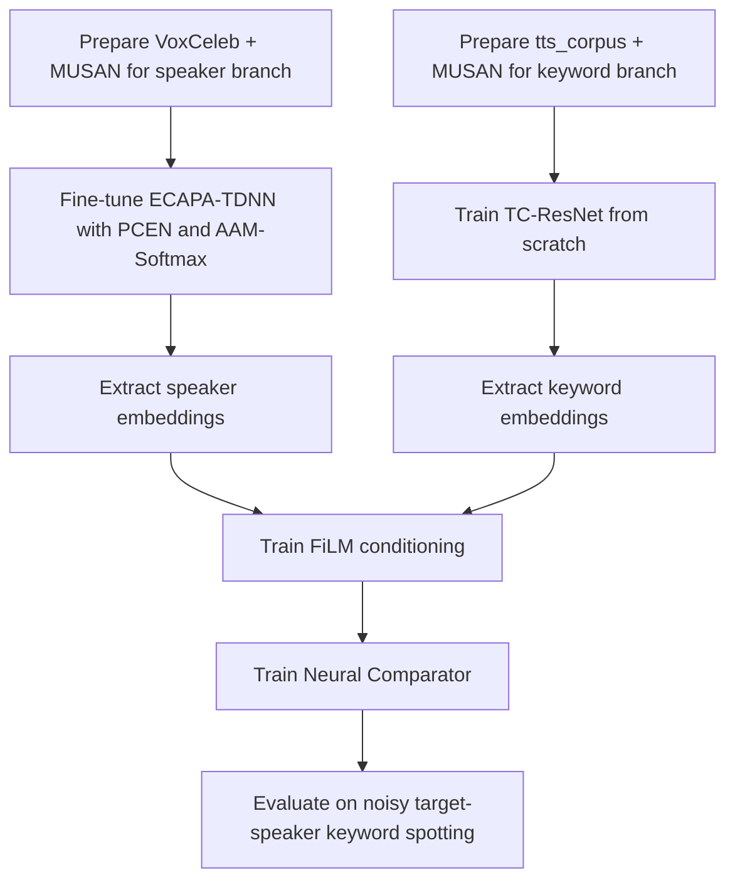

# Detailed Training and Architecture Report

## Speaker-Conditioned Target Keyword Spotting

This document explains the final system we actually built for speaker-conditioned target keyword spotting. The goal was simple to state but hard to solve: detect a user-defined keyword spoken by a specific target speaker, even in noisy real-world audio, while keeping the system lightweight and practical.

The final implementation was **not** based on an agentic workflow or multi-agent orchestration. We did not use LangGraph-style planning, MCP servers, or autonomous tool chains in the actual training pipeline. Instead, we used a direct research-and-training workflow: manual dataset preparation, model fine-tuning, loss design, and end-to-end experimentation. That is the honest description of the work in this project.

The system is built from three main parts:

1. **PCEN + ECAPA-TDNN** for speaker embedding learning.
2. **TC-ResNet** for custom keyword encoding.
3. **FiLM + Neural Comparator** for speaker-conditioned matching.

The key design idea was to separate “who is speaking” from “what word is being spoken,” and then bring both signals together only at the decision stage.

---

## 1. What We Built and Why

Traditional keyword spotting systems usually assume a fixed vocabulary and a clean microphone signal. That does not match the problem we wanted to solve. We needed a system that can:

- learn a **custom keyword**,
- work for a **specific speaker**,
- survive **background noise**,
- and run as a compact deep-learning pipeline.

To do that, we used a two-track training strategy:

- **Speaker track:** fine-tune a pre-trained SpeechBrain ECAPA-TDNN model on VoxCeleb with a PCEN frontend and a custom AAM-Softmax objective.
- **Keyword track:** train a TC-ResNet model from scratch on our own `tts_corpus` dataset, with MUSAN-based noise augmentation, so it learns the acoustic shape of words rather than fixed labels only.
- **Conditioning and comparison track:** train the FiLM-based conditioning layers and the neural comparison module from scratch so the system can combine speaker identity and keyword similarity in one learned decision process.

This design kept the speaker encoder strong, made the keyword encoder flexible, and allowed the final system to learn how to reject noise and mismatched speech.

---

## 2. High-Level Architecture

### Intuition

- The **PCEN frontend** stabilizes the signal before the neural networks see it.
- The **ECAPA-TDNN branch** captures the identity of the speaker.
- The **TC-ResNet branch** captures the acoustic pattern of the keyword.
- **FiLM** uses the speaker embedding to modulate hidden activations in the keyword branch.
- The **Neural Comparator** decides whether the live speech matches the enrolled target keyword for the enrolled target speaker.

---

## 3. Data Used in the Project

### 3.1 VoxCeleb for speaker learning
We used **VoxCeleb** for the ECAPA-TDNN speaker branch. VoxCeleb is a widely used speaker recognition dataset collected from unconstrained real-world media, which makes it a good match for speaker-embedding learning in noisy conditions.

### 3.2 MUSAN for noise injection
We used **MUSAN** for background noise, music, and speech augmentation. This helped the model learn robustness to real-world interference instead of overfitting to clean studio speech.

### 3.3 `tts_corpus` for keyword learning
We used our own custom dataset:

`https://huggingface.co/datasets/Nishchal-29/tts_corpus`

This dataset was used for the TC-ResNet training stage. The important point is that this is **our own synthetic/custom TTS corpus**, and the TC-ResNet was trained **from scratch** on it, not merely fine-tuned.

### 3.4 Why this combination worked
The datasets played different roles:

- **VoxCeleb** taught the model who the speaker is.
- **MUSAN** taught the model how to survive noise.
- **tts_corpus** taught the model what the custom word sounds like.

That division made the training pipeline much cleaner.

---

## 4. PCEN Frontend

We replaced the usual mel-spectrogram frontend with **PCEN (Per-Channel Energy Normalization)**.

### Why we changed the frontend
ECAPA-TDNN is commonly used with mel-spectrogram-style inputs, but our environment had stronger noise and loudness variation than a standard clean-speech setup. PCEN is useful because it acts like a smoother, adaptive normalization stage before the network learns its features.

### What PCEN did for us
- reduced the impact of sudden noise bursts,
- stabilized loudness differences,
- made the input more robust for speaker embedding learning,
- and improved training behavior in noisy audio.

### Simple interpretation
PCEN does not magically remove all noise. Instead, it makes the signal more consistent so the neural network can focus on useful speech structure.

---

## 5. ECAPA-TDNN: Speaker Branch

We used the **SpeechBrain ECAPA-TDNN** model as the starting point for the speaker branch and fine-tuned it for our setting.

### What ECAPA-TDNN does
ECAPA-TDNN is a speaker embedding model. It turns an utterance into a compact representation that captures speaker identity. In our system, that embedding is used as the speaker signature.

### What we changed
The important change was not just “use ECAPA-TDNN.” The real change was:

- keep the **ECAPA architecture**,
- replace the frontend with **PCEN**,
- train with **VoxCeleb**,
- augment with **MUSAN**,
- and optimize using a **custom AAM-Softmax objective**.

### Why fine-tuning instead of training from scratch
Fine-tuning was the right choice because ECAPA-TDNN already knows how to learn speaker identity well. Training from scratch would have required much more data and compute. Fine-tuning let us adapt the model to our frontend and noise conditions without losing the benefit of the pretrained speaker backbone.

### What the speaker branch learns
The branch learns a stable embedding for the enrolled speaker. That embedding is later reused as conditioning information, so the runtime system does not need to re-run a heavy speaker-verification model every time.

---

## 6. AAM-Softmax Objective for ECAPA-TDNN

For the speaker branch, we used a custom **AAM-Softmax** loss.

### Why this loss
Speaker embeddings should satisfy two properties:

- embeddings from the same speaker should be close,
- embeddings from different speakers should be well separated.

AAM-Softmax is a good fit because it explicitly encourages angular separation in embedding space. That makes the embedding geometry more discriminative, which is useful for speaker recognition and verification.

### In our project
We used the loss to strengthen the separation between speakers while the ECAPA branch learned from our PCEN-based input pipeline.

---

## 7. TC-ResNet: Keyword Branch

The second major component is **TC-ResNet**, which we trained **from scratch**.

### Why TC-ResNet
TC-ResNet is small, efficient, and designed for keyword spotting. It is a good match for short utterances and edge-friendly deployment.

### What we changed
Instead of using it as a standard fixed-label keyword classifier, we used it to learn a stronger acoustic representation of the custom keyword space.

### Training data
For this branch, we used:
- our custom `tts_corpus` dataset,
- MUSAN noise injection,
- and additional augmentation to make the words sound like real-world speech.

### Why training from scratch made sense here
The keyword vocabulary was custom and not limited to a standard benchmark list. Training from scratch on our own corpus let the model learn exactly the word patterns we cared about, rather than adapting from a mismatched pretraining task.

---

## 8. Noise Augmentation with MUSAN

MUSAN was used across the pipeline for realistic noise augmentation.

### What we did with it
We mixed clean utterances with noise at different levels so the models would see a wide range of noisy conditions during training.

### Why it mattered
Without noise augmentation, the model would likely overfit to clean audio and fail in real environments. MUSAN gave us a way to simulate difficult conditions without collecting every real-world scenario ourselves.

### Main effect
The model learned to focus on phonetic and speaker cues that survive noise instead of depending on clean acoustic detail.

---

## 9. FiLM Conditioning Module

After the two branches learn their own embeddings, we use **FiLM (Feature-wise Linear Modulation)** to condition the keyword path on the speaker embedding.

### What FiLM does
FiLM takes the speaker embedding and turns it into scaling and shifting parameters that modulate hidden activations in the keyword network.

### Why we used it
The purpose of FiLM in our system is to let the network focus on the target speaker’s acoustic pattern and suppress irrelevant voices or background interference.

### Why we trained this from scratch
This part is very specific to our architecture. It is not a standard off-the-shelf module for this task, so training it from scratch let the model learn the right modulation behavior for our exact speaker-keyword setup.

### Simple intuition
If ECAPA gives us “who is speaking,” FiLM uses that answer to reshape “what the network should listen for.”

---

## 10. Neural Comparator

The final decision is made by a learned **Neural Comparator**.

### What it compares
It compares the enrolled keyword template with the live keyword embedding, after conditioning.

### Why not use only cosine similarity
A static similarity score is simple, but it is not flexible enough to learn complex noisy cases. A small neural comparator can learn patterns like:

- when to trust a dimension,
- when to down-weight noisy features,
- when two embeddings are truly matching,
- and when the match is only superficial.

### Why training from scratch was important
Because the comparator is tightly tied to our model design, we trained the whole architecture from scratch so this module could learn the final match decision in the same feature space used by the rest of the system.

---

## 11. End-to-End Training Flow

### What this means in practice
The training was not one single pass. It was a staged process:

1. **Preprocess the audio** with PCEN and augmentation.
2. **Fine-tune ECAPA-TDNN** on VoxCeleb using AAM-Softmax.
3. **Train TC-ResNet from scratch** on the TTS keyword corpus.
4. **Train the FiLM module** so speaker conditioning works correctly.
5. **Train the Neural Comparator** so the final trigger decision is learned, not hard-coded.
6. **Evaluate** on noisy and speaker-mismatched conditions.

---

## 12. Training Details and Thought Process

### 12.1 Why the pipeline was split into stages
We split the work because each part has a different job:

- speaker recognition,
- keyword encoding,
- conditioning,
- final similarity decision.

Training them separately first made debugging easier and improved stability.

### 12.2 Why the speaker branch was fine-tuned, not rebuilt
ECAPA-TDNN already has a strong inductive bias for speaker verification. Fine-tuning was enough to adapt it to our PCEN frontend and our training setup.

### 12.3 Why the keyword branch was trained from scratch
The custom keyword corpus did not match a standard pretraining scenario, so a clean from-scratch training run was more appropriate than forcing a pretrained keyword classifier into our use case.

### 12.4 Why FiLM and the comparator were trained together
These modules are responsible for the final interaction between speaker identity and keyword identity. Training them from scratch let them learn the exact matching behavior we wanted instead of inheriting assumptions from another task.

---

## 13. What Worked Well

### PCEN frontend
PCEN was one of the most useful design choices. It made the audio more stable under noise and loudness shifts.

### ECAPA-TDNN fine-tuning
Using the SpeechBrain ECAPA-TDNN model gave us a strong speaker representation quickly. Fine-tuning on our frontend and data made it fit the project much better than a raw off-the-shelf model.

### MUSAN augmentation
Noise injection with MUSAN significantly improved robustness. It forced the models to learn useful features instead of clean-speech shortcuts.

### Training TC-ResNet from scratch on our own corpus
This worked well because the model learned the exact word patterns and pronunciations present in our synthetic data.

### End-to-end joint thinking
Even though the parts were trained in stages, we designed them as one system from the start. That made the architecture coherent and easier to reason about.

---

## 14. What Did Not Work as Well

### Using a standard speech frontend unchanged
A plain mel-spectrogram setup would have been easier, but it was not as robust for our target noisy setting. That is why we moved to PCEN.

### Treating keyword spotting as a plain classification problem
A simple closed-set classifier is not a good fit for custom keywords and target-speaker conditioning. It is too rigid.

### Trying to rely only on a static similarity metric
A static comparator is easier to implement, but it does not learn how to handle difficult false-accept cases as well as a trained neural comparator.

### Overcomplicating the system with unnecessary orchestration
An agentic pipeline sounded attractive on paper, but it was not required for the final implementation. The real gains came from model design, data design, and careful training rather than multi-agent automation.

---

## 15. Simple Summary of the Full System

At a high level, the system works like this:

- The user enrolls a speaker and keyword.
- The speaker side is represented by an ECAPA-TDNN embedding.
- The keyword side is represented by a TC-ResNet embedding.
- PCEN makes the audio more stable.
- FiLM uses the speaker embedding to condition the keyword branch.
- The Neural Comparator produces the final match decision.

The result is a compact speaker-conditioned keyword spotting system that is designed for noisy conditions and custom words.

---

## 16. References and Data Sources

- **ECAPA-TDNN**: Desplanques, Thienpondt, and Demuynck, *ECAPA-TDNN: Emphasized Channel Attention, Propagation and Aggregation in TDNN Based Speaker Verification*.
- **SpeechBrain ECAPA-TDNN model**: pretrained speaker verification model used as the starting point for our speaker branch.
- **VoxCeleb**: speaker recognition dataset used for the speaker embedding branch.
- **MUSAN**: noise corpus used for augmentation.
- **PCEN**: Per-Channel Energy Normalization frontend for robust audio preprocessing.
- **TC-ResNet**: lightweight keyword spotting architecture used for the keyword branch.
- **FiLM**: Feature-wise Linear Modulation used for conditioning the keyword branch on speaker identity.
- **AAM-Softmax**: margin-based speaker-discriminative loss used for the speaker branch.
- **Custom TTS corpus**: `https://huggingface.co/datasets/Nishchal-29/tts_corpus`

---

## 17. Closing Note

This project was built as a practical speech system, not as an agent demo. The real contribution was in the architectural choices:

- PCEN for stability,
- ECAPA-TDNN for speaker identity,
- TC-ResNet for keyword structure,
- MUSAN for noise robustness,
- FiLM for conditioning,
- and a neural comparator for learned matching.

That combination is what makes the final system simple to explain but still technically strong.
