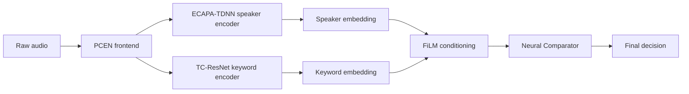
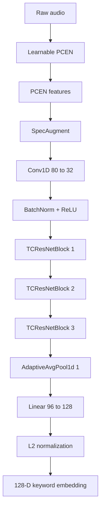

# Speaker-Conditioned Target Keyword Spotting (SC-TKWS)

A zero-shot, speaker-aware keyword spotting system that triggers **only when the enrolled speaker says the enrolled keyword**.

Unlike conventional wake-word systems that activate when anyone speaks a trigger phrase, SC-TKWS combines biometric speaker verification and phonetic keyword verification into a single edge-deployable architecture.

The system was designed for:

* Personalized wake words
* Voice-controlled IoT devices
* Secure voice authentication
* Offline assistants
* Embedded and edge deployment

All inference components are exported to ONNX and optimized for low-latency execution.

---

## Motivation

Traditional keyword spotting systems solve:

> "Was the keyword spoken?"

SC-TKWS solves:

> "Was the enrolled keyword spoken by the enrolled user?"

This requires jointly modeling:

* **Speaker Identity** (WHO spoke?)
* **Keyword Intent** (WHAT was spoken?)

while remaining computationally lightweight enough for edge deployment.

---

## Architecture and System Flow

### Enrollment Phase

```text
                    Enrollment
┌──────────────────────────────────────────┐
│                                          │
│  User says custom keyword 3 times        │
│                                          │
└──────────────────────────────────────────┘
                    │
                    ▼
        ECAPA-TDNN Speaker Encoder
                    │
                    ▼
         192-D Speaker Embedding
                    │
                    ▼
             FiLM Generator
                    │
          γ (gamma), β (beta)
                    │
                    ▼
        FiLM-Conditioned TC-ResNet
                    │
                    ▼
          128-D Keyword Template
                    │
                    ▼
             Stored Profile

```

### Inference Phase

```text
Incoming Audio
      │
      ▼
KWS PCEN Frontend
      │
      ▼
FiLM-TC-ResNet
      │
      ▼
128-D Query Embedding
      │
      ▼
Neural Comparator
      │
      ▼
Accept / Reject

```

### End-to-End System Flow



---

## Core Components

### 1. ECAPA-TDNN Speaker Encoder

Extracts a 192-dimensional biometric representation. Used only during enrollment.

**Input:**

* PCEN Features
* 3-second audio window

**Output:**
$e_s \in \mathbb{R}^{192}$

**PCEN Formulation:**
PCEN behaves like a trainable dynamic compression and normalization step. The smoothed background estimate is:


$$M(t, f) = (1 - s) M(t - 1, f) + sE(t, f)$$

The PCEN output is:


$$\mathrm{PCEN}(t, f) = \left( \frac{E(t, f)}{(\epsilon + M(t, f))^\alpha} + \delta \right)^r - \delta^r$$

**AAM-Softmax Loss:**
The encoder is fine-tuned using Additive Angular Margin Softmax to compact embeddings for the same speaker:


$$L_{\text{AAM}} = -\frac{1}{N}\sum_{i=1}^{N} \log \frac{ e^{s(\cos(\theta_{y_i}) + m)} }{ e^{s(\cos(\theta_{y_i}) + m)} + \sum_{j \neq y_i} e^{s\cos(\theta_j)} }$$

### 2. FiLM Generator

Transforms the speaker embedding into modulation parameters:


$$\gamma, \beta = \mathrm{MLP}(e_s)$$

**Architecture:**

* `Linear(192 → 128)`
* `ReLU`
* `Linear(128 → 384)`

**Output:**

* 192 $\gamma$ parameters
* 192 $\beta$ parameters

These parameters become a biometric gate controlling the TC-ResNet feature space.

### 3. FiLM-Conditioned TC-ResNet

Modified TC-ResNet acoustic encoder trained for keyword representation.

**Structure:**

* Conv Projection
* Layer 1 (Speaker Independent)
* Layer 2 (Speaker Independent)
* Layer 3 (FiLM Conditioned)

**Keyword Encoder Flowchart:**



**TC-ResNet Block Design:**
Each block follows the residual pattern:


$$\text{Output} = \mathrm{ReLU}(F(x) + x)$$

**FiLM Modulation:**
The features are dynamically altered using the generated parameters:


$$F'_{c,t} = \gamma_c F_{c,t} + \beta_c$$

This allows the network to dynamically amplify acoustic patterns consistent with the enrolled speaker while suppressing competing voices.

**Contrastive Objective:**


$$L_{\text{triplet}} = \max\left( 0,\, \|f(A) - f(P)\|_2^2 - \|f(A) - f(N)\|_2^2 + \alpha \right)$$

### 4. Neural Comparator

Instead of a fixed cosine threshold, SC-TKWS uses a learned comparator to evaluate the relationship between the master template ($w_c$) and the live embedding ($w_{\text{live}}$).

**Input Construction:**


$$V_{\text{comp}} = [w_c \,\|\, w_{\text{live}} \,\|\, (w_c - w_{\text{live}}) \,\|\, (w_c \odot w_{\text{live}})]$$

**Architecture:**

* `Linear(384, 32)`
* `ReLU`
* `Linear(32, 1)`

**Output Probability:**


$$P_{\text{match}} = \sigma\left(W_2 \cdot \mathrm{ReLU}(W_1 V_{\text{comp}} + b_1) + b_2\right)$$

This improves robustness against noise, similar sounding words, speaker leakage, and hard phonetic negatives.

---

## Model Statistics

| Component | Parameter Count |
| --- | --- |
| **FiLM Generator** | ≈ 74K |
| **FiLM-TC-ResNet Encoder** | ≈ 286K |
| **Neural Comparator** | ≈ 12K |
| **Total Stage-4 KWS Stack** | **≈ 372K** |

*(Note: Total excludes the ECAPA-TDNN speaker encoder which is only used during enrollment.)*

---

## Training Pipeline

The model was trained sequentially in four stages to ensure each module learned its specific role before being combined.

### Stage 1 — Speaker Representation Learning

* **Model:** ECAPA-TDNN
* **Objective:** Speaker verification
* **Output:** 192-D speaker embeddings
* **Artifacts:** `ecapa_tdnn.onnx`, `ecapa_pcen.json`

### Stage 2 — Keyword Representation Learning

* **Model:** TC-ResNet
* **Objective:** Supervised Contrastive Learning
* **Dataset:** 3000-word synthetic keyword corpus containing TTS-generated speakers, hard phonetic negatives, proper nouns, commands, technology vocabulary, and synthetic non-words.
* **Output:** 128-D keyword embeddings
* **Artifacts:** `conditioned_encoder.onnx`, `kws_pcen.json`

### Stage 3 — Speaker Conditioning

* **Goal:** Learn speaker-aware acoustic filtering.
* **Training Strategy:** Collision mixing (target speaker + interfering speaker), biometric negative sampling, and supervised contrastive loss.
* **Trainable Modules:** Only the FiLM Generator, Layer 3, and Projection Head were updated.

### Stage 4 — Comparator Fine-Tuning

* **Goal:** Optimize final verification accuracy.
* **Training Signals:**
* *Positive Pair:* Correct Speaker + Correct Word
* *Negative Pair:* Wrong Speaker + Correct Word
* *Hard Negative Pair:* Correct Speaker + Phonetically Similar Word


* **Loss Function:** BCE Loss + Margin Ranking Loss

---

## Enrollment

Enroll a user with three recordings of the target keyword.

```bash
python enroll.py \
    accept1.wav \
    accept2.wav \
    accept3.wav \

```

Generated profile:

```json
{
  "gamma": "...",
  "beta": "...",
  "template": "..."
}

```

---

## Verification

```bash
python inference.py \
    --audio query.wav \
    --profile profile.json

```

Output:

```text
Probability: 0.983
Match: True

```

---

## ONNX Deployment

All inference modules are exported to ONNX to ensure efficient cross-platform execution.

**Artifacts:**

* `ecapa_tdnn.onnx`
* `film_generator.onnx`
* `conditioned_encoder.onnx`
* `neural_comparator.onnx`

**Advantages:**

* CPU inference
* Edge deployment
* Cross-platform compatibility
* No PyTorch dependency required during inference

---

## Repository Structure

```text
speaker-conditioned-target-kws/
│
├── enroll.py
├── inference.py
├── model.py
├── requirements.txt
│
├── models/
│   ├── ecapa_tdnn.onnx
│   ├── ecapa_pcen.json
│   ├── film_generator.onnx
│   ├── conditioned_encoder.onnx
│   ├── kws_pcen.json
│   └── neural_comparator.onnx
│
└── enrolled_profile.json

```
