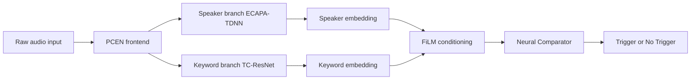
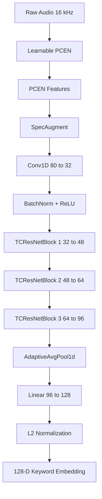
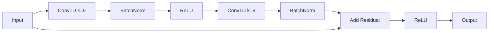
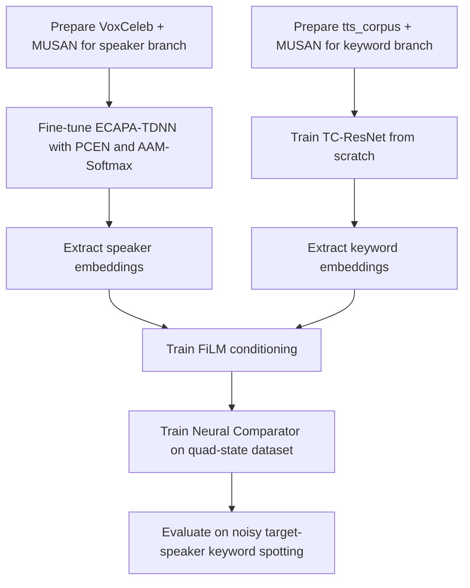

# Detailed Training and Architecture Report

## Speaker-Conditioned Target Keyword Spotting

This document describes the system we actually built for speaker-conditioned target keyword spotting. The task is to detect a user-defined keyword spoken by a specific target speaker in noisy real-world audio, while keeping the model compact and practical.

The final system has three parts:

1. **PCEN + ECAPA-TDNN** for speaker embedding learning.
2. **PCEN + TC-ResNet** for keyword embedding learning.
3. **FiLM + Neural Comparator** for speaker-conditioned matching.

The main idea is to separate **who is speaking** from **what word is being spoken**, and then combine both signals only at the final decision stage.

---

## 1. What We Built

A standard keyword spotter usually assumes a fixed vocabulary and relatively clean speech. That is not enough for our use case. We needed a system that can:

- learn a **custom keyword**,
- work for a **specific target speaker**,
- remain robust in **background noise**,
- and stay lightweight enough to be practical.

To do that, we used a two-track approach:

- **Speaker track:** fine-tune a pretrained SpeechBrain ECAPA-TDNN model on VoxCeleb using a PCEN frontend and a custom AAM-Softmax objective.
- **Keyword track:** train a TC-ResNet model from scratch on our own `tts_corpus` dataset, with MUSAN-based noise augmentation, so it learns the acoustic shape of words rather than only fixed labels.
- **Conditioning and comparison track:** train the FiLM module and Neural Comparator from scratch so the system can combine speaker identity and keyword similarity in one learned decision process.

---

## 2. High-Level Architecture

### Intuition

- **PCEN** stabilizes the signal before the networks see it.
- **ECAPA-TDNN** captures the identity of the target speaker.
- **TC-ResNet** captures the acoustic structure of the keyword.
- **FiLM** uses the speaker embedding to modulate hidden activations in the keyword path.
- The **Neural Comparator** decides whether the live speech matches the enrolled target keyword for the enrolled target speaker.

---

## 3. Data Used

### 3.1 VoxCeleb for speaker learning
We used **VoxCeleb** for the ECAPA-TDNN speaker branch. It is a real-world speaker recognition dataset with a lot of speaker variation, which makes it a strong fit for learning speaker identity.

### 3.2 MUSAN for noise injection
We used **MUSAN** for background noise, music, and speech augmentation. This helped the model learn robustness to real-world interference instead of overfitting to clean audio.

### 3.3 `tts_corpus` for keyword learning
We used our custom dataset:

`https://huggingface.co/datasets/Nishchal-29/tts_corpus`

This dataset was used for the TC-ResNet training stage. The key point is that this is **our own synthetic/custom TTS corpus**, and the TC-ResNet was trained **from scratch** on it.

### 3.4 Why this combination worked
The datasets played different roles:

- **VoxCeleb** taught the model who the speaker is.
- **MUSAN** taught the model how to survive noise.
- **tts_corpus** taught the model what the custom word sounds like.

That separation made the training pipeline much cleaner.

---

## 4. PCEN Frontend

We replaced the usual mel-spectrogram frontend with **PCEN (Per-Channel Energy Normalization)**.

### Why we changed it
The original ECAPA setup is commonly used with mel-style features, but our setting had stronger noise and loudness variation. PCEN works better as an adaptive frontend because it smooths the input and reduces the effect of sudden amplitude spikes.

### What PCEN gave us
- reduced the effect of sudden noise bursts,
- stabilized loudness differences,
- made the input more robust for speaker learning,
- and improved training behavior in noisy audio.

### Simple interpretation
PCEN does not remove all noise. It makes the signal easier for the network to learn from.

---

## 5. ECAPA-TDNN Speaker Branch

We used the **SpeechBrain ECAPA-TDNN** model as the starting point for the speaker branch and fine-tuned it.

### What it does
ECAPA-TDNN converts an utterance into a compact embedding that captures speaker identity. In our system, that embedding becomes the speaker signature.

### What we changed
The real change was:

- keep the ECAPA backbone,
- replace the frontend with **PCEN**,
- train on **VoxCeleb**,
- augment with **MUSAN**,
- and optimize using a **custom AAM-Softmax loss**.

### Why fine-tuning was the right choice
ECAPA-TDNN already has a strong bias toward speaker verification. Fine-tuning let us adapt the model to our frontend and noise conditions without losing the benefit of the pretrained speaker backbone.

### What the speaker branch learns
The branch learns a stable speaker embedding. That embedding is later reused as conditioning information, so the runtime system does not need to keep running a heavy speaker model at inference time.

---

## 6. AAM-Softmax for ECAPA-TDNN

For the speaker branch, we used a custom **AAM-Softmax** loss.

### Why this loss
Speaker embeddings should satisfy two properties:

- embeddings from the same speaker should be close,
- embeddings from different speakers should be far apart.

AAM-Softmax is good at that because it encourages angular separation in embedding space. That makes the speaker representation more discriminative.

---

## 7. TC-ResNet Keyword Branch

The second major component is **TC-ResNet**, which we trained **from scratch**.

### Why TC-ResNet
TC-ResNet is small, efficient, and suitable for keyword spotting. It works well for short utterances and compact deployment.

### What we changed
We did not use it as a standard fixed-label classifier only. We used it as a strong acoustic encoder for the custom keyword space.

### Training data
For this branch, we used:

- our custom `tts_corpus` dataset,
- MUSAN noise injection,
- and additional augmentation to make the words more realistic.

### Why training from scratch made sense
Our keyword vocabulary was custom and not limited to a standard benchmark list. Training from scratch on our own corpus let the model learn exactly the word patterns we wanted.

### TC-ResNet code-to-architecture diagram

### How each block maps to the code

- **Learnable PCEN** converts raw audio into robust PCEN features.
- **SpecAugment** masks frequency bands and time spans during training.
- **Conv1D** maps the 80-channel acoustic input into a 32-channel feature map.
- **TCResNetBlock 1** expands 32 to 48 channels with stride 2 and dilation 1.
- **TCResNetBlock 2** expands 48 to 64 channels with stride 2 and dilation 2.
- **TCResNetBlock 3** expands 64 to 96 channels with stride 2 and dilation 4.
- **AdaptiveAvgPool1d** compresses the time dimension into one vector.
- **Linear layer** maps the 96-D pooled vector to a 128-D embedding.
- **L2 normalization** makes the embedding stable for comparison.

### Residual block view

This block is repeated with different channel sizes, strides, and dilations to build the full encoder.

---

## 8. MUSAN Noise Augmentation

MUSAN was used across the pipeline for realistic noise augmentation.

### What we did
We mixed clean utterances with noise at different levels so the model would see a wide range of noisy conditions during training.

### Why it mattered
Without noise augmentation, the model would likely overfit to clean speech and fail in real environments. MUSAN forced the models to learn useful acoustic cues instead of clean-speech shortcuts.

---

## 9. FiLM Conditioning Module

After the two branches learn their embeddings, we use **FiLM (Feature-wise Linear Modulation)** to condition the keyword path on the speaker embedding.

### What FiLM does
FiLM turns the speaker embedding into scale and shift parameters that modulate hidden activations in the keyword network.

### Why we used it
The goal is to make the model focus on the target speaker’s acoustic pattern and suppress irrelevant voices or background interference.

### Why we trained it from scratch
This module is specific to our architecture, so training it from scratch let the model learn the right modulation behavior for our exact speaker-keyword setup.

### Simple intuition
ECAPA gives us “who is speaking.” FiLM uses that answer to reshape “what the network should listen for.”

---

## 10. Neural Comparator

The final decision is made by a learned **Neural Comparator**.

### What it compares
It compares the enrolled keyword template with the live keyword embedding after conditioning.

### Why not use only cosine similarity
A static similarity score is simple, but it is not flexible enough to learn difficult noisy cases. A small neural comparator can learn:

- when to trust a dimension,
- when to down-weight noisy features,
- when two embeddings truly match,
- and when the match is only superficial.

---

## 11. Quad-State Training Dataset for FiLM + Neural Comparator

This was one of the most important design choices in the final stage.

We used a specially designed **quad-state dataset** so the FiLM + Neural Comparator module could learn all important combinations of speaker and word correctness.

### The four cases

1. **True word, true speaker**
   - The correct keyword spoken by the correct enrolled speaker.
   - This is the positive trigger case.

2. **True word, false speaker**
   - The correct keyword spoken by a different speaker.
   - This teaches the system to reject imposters even if the word is correct.

3. **False word, true speaker**
   - A wrong or phonetically similar word spoken by the enrolled speaker.
   - This teaches the system not to trigger on the right voice alone.

4. **False word, false speaker**
   - Wrong word spoken by the wrong speaker.
   - This is the easiest negative case, but it is still important for stability.

### Why this dataset mattered
This quad-state setup forced the FiLM conditioning and Neural Comparator to learn the actual decision boundary of the task. The model could not simply memorize “speaker correct” or “keyword correct.” It had to learn the interaction between both.

### Practical effect
This made the final decision module much more reliable, especially on confusing near-matches and noisy utterances.

---

## 12. End-to-End Training Flow

### What this means in practice
The training was staged, not a single pass:

1. preprocess audio with PCEN and augmentation,
2. fine-tune ECAPA-TDNN on VoxCeleb using AAM-Softmax,
3. train TC-ResNet from scratch on the TTS keyword corpus,
4. train FiLM using the quad-state examples,
5. train the Neural Comparator on the same structured cases,
6. evaluate on noisy and speaker-mismatched conditions.

---

## 13. Training Details and Thought Process

### Why the pipeline was split into stages
Each part had a different job:

- speaker recognition,
- keyword encoding,
- conditioning,
- final similarity decision.

Training them separately first made debugging easier and improved stability.

### Why the speaker branch was fine-tuned, not rebuilt
ECAPA-TDNN already has a strong inductive bias for speaker verification. Fine-tuning was enough to adapt it to our PCEN frontend and noise setup.

### Why the keyword branch was trained from scratch
The custom keyword corpus did not match a standard pretraining scenario, so a from-scratch training run was more appropriate than forcing a pretrained keyword classifier into the task.

### Why FiLM and the comparator were trained together
These modules are responsible for the final interaction between speaker identity and keyword identity. Training them from scratch let them learn the exact matching behavior we wanted.

---

## 14. What Worked Well

### PCEN frontend
PCEN was one of the most useful choices. It made the audio more stable under noise and loudness shifts.

### ECAPA-TDNN fine-tuning
Using the SpeechBrain ECAPA-TDNN model gave us a strong speaker representation quickly. Fine-tuning on our frontend and data made it fit the project much better than a raw off-the-shelf model.

### MUSAN augmentation
Noise injection with MUSAN improved robustness and reduced dependence on clean speech.

### TC-ResNet from scratch on our own corpus
This worked well because the model learned the exact word patterns and pronunciations in our synthetic data.

### Quad-state dataset for FiLM + comparator
This was especially useful because it gave the final decision module all important positive and negative combinations instead of only a simple yes/no split.

---

## 15. What Did Not Work as Well

### Using a standard speech frontend unchanged
A plain mel-spectrogram setup was easier, but it was not as robust for our noisy setting. That is why we moved to PCEN.

### Treating keyword spotting as plain classification
A simple closed-set classifier is not a good fit for custom keywords and target-speaker conditioning. It is too rigid.

### Relying only on a static similarity metric
A static comparator is easy to implement, but it does not learn difficult false-accept cases as well as a trained neural comparator.

### Adding unnecessary orchestration
An agentic pipeline sounded interesting on paper, but it was not needed for the final implementation. The real gains came from model design, data design, and careful training.

---

## 16. Simple Summary of the Full System

At a high level, the system works like this:

- The user enrolls a speaker and keyword.
- ECAPA-TDNN produces a speaker embedding.
- TC-ResNet produces a keyword embedding.
- PCEN makes the audio more stable.
- FiLM uses the speaker embedding to condition the keyword branch.
- The Neural Comparator decides whether the live speech matches the enrolled target.

The result is a compact speaker-conditioned keyword spotting system designed for noisy conditions and custom words.

---

## 17. References and Data Sources

- **ECAPA-TDNN**: Desplanques, Thienpondt, and Demuynck, *ECAPA-TDNN: Emphasized Channel Attention, Propagation and Aggregation in TDNN Based Speaker Verification*.
- **SpeechBrain ECAPA-TDNN**: pretrained speaker verification model used as the starting point for the speaker branch.
- **VoxCeleb**: speaker recognition dataset used for speaker embedding learning.
- **MUSAN**: noise corpus used for augmentation.
- **PCEN**: Per-Channel Energy Normalization frontend for robust audio preprocessing.
- **TC-ResNet**: lightweight keyword spotting architecture used for the keyword branch.
- **FiLM**: Feature-wise Linear Modulation used for conditioning.
- **AAM-Softmax**: margin-based speaker-discriminative loss used for the speaker branch.
- **Custom TTS corpus**: `https://huggingface.co/datasets/Nishchal-29/tts_corpus`

---

## 18. Closing Note

This project was built as a practical speech system, not as an agent demo. The real contribution was in the architectural choices:

- PCEN for stability,
- ECAPA-TDNN for speaker identity,
- TC-ResNet for keyword structure,
- MUSAN for noise robustness,
- FiLM for conditioning,
- the quad-state dataset for decision learning,
- and a neural comparator for learned matching.

That combination is what makes the final system simple to explain but technically strong.
