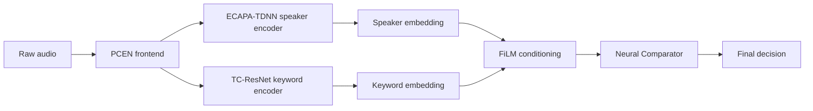
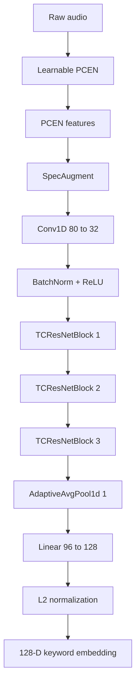

# Speaker-Conditioned Target Keyword Spotting  
## Technical Report for Training, Architecture, and Design Choices

## 1. Overview

This project solves speaker-conditioned custom keyword spotting in noisy environments. The goal is to detect a user-defined keyword only when it is spoken by the enrolled target speaker, even under heavy acoustic degradation.

Our final system is built from three main parts:

1. **ECAPA-TDNN speaker encoder**  
   Fine-tuned with a **PCEN frontend** on **VoxCeleb** using **MUSAN noise injection** and **AAM-Softmax** loss.

2. **TC-ResNet keyword encoder**  
   Trained **from scratch** on our custom **`tts_corpus`** dataset, with additional real-life noise augmentation using **MUSAN**.

3. **FiLM + Neural Comparator**  
   Trained on a specially designed **quad-state dataset** containing all four meaningful speaker/word combinations.

The key idea is simple: first learn **who** is speaking, then learn **what** is being spoken, and finally combine both through a speaker-conditioned decision module.

---

## 2. Why this architecture

A standard keyword spotter is not enough for our use case because it usually treats the word as the only signal of interest. That fails when the same keyword is spoken by the wrong speaker or when a different word is spoken by the target speaker.

We needed a system that learns two different forms of information:

- **Biometric identity**: the speaker’s voice characteristics
- **Phonetic identity**: the keyword content itself

That is why we designed the system in stages instead of training a single monolithic classifier.

This also helped us keep the architecture modular:

- ECAPA-TDNN is responsible for speaker representation.
- TC-ResNet is responsible for keyword representation.
- FiLM uses the speaker embedding to condition the keyword network.
- The Neural Comparator decides whether the live keyword matches the enrolled template.

---

## 3. System flow

---

## 4. Stage 1: ECAPA-TDNN speaker encoder

We used the open-source **SpeechBrain ECAPA-TDNN** model as the starting point for speaker representation learning. The model was not used as-is. We fine-tuned it on our setup so that it works with our **PCEN frontend** instead of the default mel-spectrogram pipeline.

### 4.1 Why PCEN

The original ECAPA-TDNN is commonly trained on mel-spectrogram features. In our case, we wanted stronger robustness in noisy environments, so we replaced the frontend with **Per-Channel Energy Normalization (PCEN)**.

PCEN behaves like a trainable dynamic compression and normalization step. It reduces the effect of background noise while preserving speech transients.

### 4.2 PCEN formulation

Let $E(t,f)$ be the input time-frequency energy at time $t$ and frequency bin $f$. The smoothed background estimate is:

$$
M(t,f) = (1 - s)M(t-1,f) + sE(t,f)
$$

The PCEN output is:

$$
\mathrm{PCEN}(t,f)
=
\left(
\frac{E(t,f)}{(\epsilon + M(t,f))^\alpha}
+
\delta
\right)^r
-
\delta^r
$$

where:

- $\epsilon$ is a small stabilizing constant
- $M(t,f)$ is the smoothed local energy estimate
- $\alpha$ controls noise suppression strength
- $\delta$ controls the offset
- $r$ controls compression
- $s$ controls temporal smoothing

This frontend was important because it made the speaker encoder more stable under real-world noise and reverberation.

### 4.3 Speaker encoder training setup

We fine-tuned ECAPA-TDNN on:

- **VoxCeleb** for speaker identity learning
- **MUSAN** for noise augmentation

The training objective was **Additive Angular Margin Softmax (AAM-Softmax)**.

### 4.4 AAM-Softmax loss

For a sample $i$ with ground-truth class $y_i$, AAM-Softmax is:

$$
L_{\text{AAM}}
=
-\frac{1}{N}
\sum_{i=1}^{N}
\log
\frac{
e^{s(\cos(\theta_{y_i}) + m)}
}{
e^{s(\cos(\theta_{y_i}) + m)} + \sum_{j \neq y_i} e^{s\cos(\theta_j)}
}
$$

where:

- $\theta_{y_i}$ is the angle between the feature and the correct class center
- $m$ is the angular margin
- $s$ is the scale factor

This loss helps the speaker embeddings become more compact for the same speaker and more separated across different speakers.

### 4.5 What we learned here

This stage worked well because:

- PCEN improved robustness in noisy conditions.
- VoxCeleb provided strong speaker diversity.
- AAM-Softmax gave a better embedding structure than plain softmax.

What did not work as well:

- Training on raw mel features was less stable in our noisy setting.
- Without MUSAN augmentation, generalization dropped noticeably.
- If the frontend and encoder were trained inconsistently, the embeddings became less reliable.

---

## 5. Stage 2: TC-ResNet keyword encoder

The keyword encoder was trained completely from scratch using our own synthetic and augmented data pipeline. Unlike ECAPA, this part was not fine-tuned from a pretrained speech model. It was built for keyword representation learning from the ground up.

### 5.1 Training data

We used:

- our custom **`tts_corpus`** dataset
- **MUSAN** for realistic noise injection

The custom dataset was created to cover many word forms and speaking conditions, so the model could generalize beyond a fixed vocabulary.

### 5.2 Why train from scratch

We wanted the TC-ResNet branch to learn a phonetic embedding space that is suited to arbitrary user-defined keywords. Pretraining on a different task would have biased the model toward a fixed vocabulary, so training from scratch gave us better control.

### 5.3 TC-ResNet block structure

The encoder is built from:

- a **Learnable PCEN** frontend
- **SpecAugment**
- a small **Conv1D** stem
- three **TCResNet residual blocks**
- **Global Average Pooling**
- a final **Linear** layer
- **L2 normalization**

### 5.4 TC-ResNet architecture

### 5.5 TC-ResNet block design

Each block follows the residual pattern:

$$
\text{Output} = \mathrm{ReLU}(F(x) + x)
$$

where $F(x)$ is the stacked convolutional transformation.

The blocks progressively increase channel capacity:

- Block 1: $32 \rightarrow 48$
- Block 2: $48 \rightarrow 64$
- Block 3: $64 \rightarrow 96$

The stride and dilation settings help the network capture longer phonetic context without making the model too large.

### 5.6 SpecAugment

We also used SpecAugment during training to improve robustness.

It applies:

- frequency masking
- time masking

This helped the encoder avoid overfitting to clean and narrow acoustic patterns.

### 5.7 Keyword encoder training objective

The TC-ResNet branch was trained to produce meaningful keyword embeddings. The embeddings are normalized so that distance-based or metric-learning objectives behave better.

A common formulation for triplet learning is:

$$
L_{\text{triplet}}
=
\max\left(
0,\,
\lVert f(A) - f(P) \rVert_2^2
-
\lVert f(A) - f(N) \rVert_2^2
+
\alpha
\right)
$$

where:

- $A$ is the anchor
- $P$ is the positive sample
- $N$ is the negative sample
- $\alpha$ is the margin

### 5.8 What worked and what did not

What worked:

- Training from scratch on the custom TTS corpus gave good flexibility.
- MUSAN noise made the keyword branch more robust in realistic environments.
- PCEN + SpecAugment improved stability under noise.

What did not work as well:

- Training without the custom synthetic corpus did not generalize well to unseen words.
- A plain fixed softmax vocabulary would not fit the open-set custom keyword setting.
- Without augmentation, the embedding space became too sensitive to clean-speech bias.

---

## 6. Quad-state dataset for FiLM + Neural Comparator

After the ECAPA speaker encoder and TC-ResNet keyword encoder were prepared, the final FiLM + Neural Comparator module was trained using a specially designed **quad-state dataset**.

This was one of the most important parts of the project because it directly teaches the model the boundary between speaker identity and word identity.

### 6.1 The four states

Each training example belongs to one of these cases:

| Case | Speaker | Word | Label |
|------|---------|------|-------|
| True speaker, true word | Target speaker | Target keyword | Positive |
| False speaker, true word | Wrong speaker | Target keyword | Negative |
| True speaker, false word | Target speaker | Wrong keyword | Negative |
| False speaker, false word | Wrong speaker | Wrong keyword | Negative |

This means the model does not only see “correct” and “incorrect” examples. It sees the four meaningful combinations that matter in real use.

### 6.2 Why this dataset matters

Without this setup, the system could easily learn the wrong shortcut:

- only speaker identity
- only word identity
- or a weak mixture of both

The quad-state formulation forces the model to treat speaker information and keyword information as two separate factors and then combine them properly at the final decision stage.

### 6.3 FiLM conditioning

The speaker embedding is injected into the keyword pathway using **Feature-wise Linear Modulation (FiLM)**.

If $F \in \mathbb{R}^{C \times T}$ is a feature map and the speaker embedding is $e_s$, then:

$$
\gamma, \beta = \mathrm{MLP}(e_s)
$$

and the feature transformation is:

$$
F'_{c,t} = \gamma_c F_{c,t} + \beta_c
$$

This lets the speaker representation reshape the keyword features dynamically.

### 6.4 Neural Comparator

Instead of comparing embeddings only with cosine similarity, we used a small learned comparator.

The comparator receives:

- the master keyword template
- the live keyword embedding

A useful comparison tensor is:

$$
V_{\text{comp}}
=
[w_c \,\|\, w_{\text{live}} \,\|\, (w_c - w_{\text{live}}) \,\|\, (w_c \odot w_{\text{live}})]
$$

The final output probability is:

$$
P_{\text{match}}
=
\sigma\left(
W_2 \cdot \mathrm{ReLU}(W_1V_{\text{comp}} + b_1) + b_2
\right)
$$

This helped the model learn non-linear similarity patterns instead of relying only on geometric distance.

### 6.5 Why this stage was trained from scratch

We trained the FiLM + Neural Comparator block from scratch because:

- it is task-specific
- it must learn our custom four-case decision boundary
- pretrained speech models do not directly capture this joint decision problem

### 6.6 What worked and what did not

What worked:

- Quad-state training reduced false acceptances.
- FiLM conditioning improved speaker-specific keyword detection.
- The learned comparator was more flexible than raw cosine similarity.

What did not work as well:

- Training only on positive samples caused overfitting.
- Training without the false-speaker and false-word cases made the decision boundary too weak.
- A static similarity threshold was not enough for robust noisy speech.

---

## 7. End-to-end training philosophy

The project was built in stages rather than as one giant model.

### Stage 1
Fine-tune ECAPA-TDNN with PCEN on VoxCeleb using AAM-Softmax.

### Stage 2
Train TC-ResNet from scratch on the custom TTS corpus with MUSAN augmentation.

### Stage 3
Train FiLM + Neural Comparator on the quad-state dataset.

This staged process was useful because each module could learn its own role before being combined into the final system.

---

## 8. High-level summary of the final architecture

- **PCEN frontend** gives noise-robust acoustic normalization.
- **ECAPA-TDNN** learns a strong speaker embedding.
- **TC-ResNet** learns a keyword embedding from custom training data.
- **FiLM** injects speaker identity into the keyword pathway.
- **Neural Comparator** makes the final accept/reject decision.
- **Quad-state training** makes the decision boundary explicit and reliable.

---

## 9. What we found most important

The most important design choice was not a single model, but the way the modules were trained together.

The final system worked because:

- the speaker branch was trained for identity,
- the keyword branch was trained for phonetics,
- the decision module was trained on all four realistic combinations,
- and noise augmentation was used throughout.

That combination is what made the architecture practical for speaker-conditioned keyword spotting.

## 10. Datasets used

- **VoxCeleb**: speaker representation learning
- **MUSAN**: noise injection and robustness
- **`tts_corpus`**: custom keyword training from scratch
